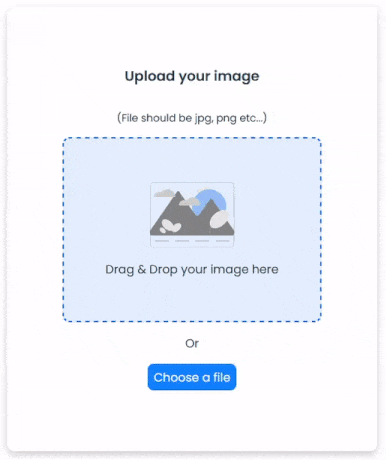

<!-- Please update value in the {}  -->

<h1 align="center">Simple Image Uploader</h1>

   Solution for a challenge from  <a href="http://devchallenges.io" target="_blank">Devchallenges.io</a>.

  <h3>
    <a href="https://taupe-belekoy-a72796.netlify.app/">
      Demo
    </a>
     | 
    <a href="https://github.com/yuandere/image-uploader-backend">
      Backend
    </a>
     | 
    <a href="https://devchallenges.io/challenges/O2iGT9yBd6xZBrOcVirx">
      Challenge
    </a>
  </h3>

  

This uploader takes an image from the user and by using Multer, the [backend](https://github.com/yuandere/image-uploader-backend) sends it to a storage bucket hosted on Google Cloud Platform.

### Built With

<!-- This section should list any major frameworks that you built your project using. Here are a few examples.-->

## Features

<!-- List the features of your application or follow the template. Don't share the figma file here :) -->

This application/site was created as a submission to a [DevChallenges](https://devchallenges.io/challenges) challenge. The [challenge](https://devchallenges.io/challenges/O2iGT9yBd6xZBrOcVirx) was to build an application to complete the given user stories.

## Acknowledgements

<!-- This section should list any articles or add-ons/plugins that helps you to complete the project. This is optional but it will help you in the future. For example -->

- [Loading animations](https://icons8.com/preloaders/en/horizontal)
- [Drag & Drop in React](https://www.codemzy.com/blog/react-drag-drop-file-upload)

## Contact

- GitHub [@yuandere](https://github.com/yuandere)
- Discord [@al doub#7487](https://discordapp.com)
- Email [derek.lee881@gmail.com](mailto:derek.lee881@gmail.com)
